This a customized version of the Node.js sample app that is available with the [Watson Machine Learning Service on IBM Bluemix](http://www.ng.bluemix.net/docs/#services/PredictiveModeling/index.html) 
This version of the app is to be used with a lab for the Watson Machine Learning Service  to  test a predictive model developed in the lab.. 

See the [original app](https://github.com/pmservice/predictive-modeling-samples) for a walkthrough of the source code. 

# Lab - Create and deploy a scoring model to predict heart failure w/Bluemix and the IBM Data Science Experience

© Copyright IBM Corporation 2017

IBM, the IBM logo and ibm.com are trademarks of International Business Machines Corp., registered in many jurisdictions worldwide. Other product and service names might be trademarks of IBM or other companies. A current list of IBM trademarks is available on the Web at &quot;Copyright and trademark information&quot; at www.ibm.com/legal/copytrade.shtml.

This document is current as of the initial date of publication and may be changed by IBM at any time.

The information contained in these materials is provided for informational purposes only, and is provided AS IS without warranty of any kind, express or implied. IBM shall not be responsible for any damages arising out of the use of, or otherwise related to, these materials. Nothing contained in these materials is intended to, nor shall have the effect of, creating any warranties or representations from IBM or its suppliers or licensors, or altering the terms and conditions of the applicable license agreement governing the use of IBM software. References in these materials to IBM products, programs, or services do not imply that they will be available in all countries in which IBM operates. This information is based on current IBM product plans and strategy, which are subject to change by IBM without notice. Product release dates and/or capabilities referenced in these materials may change at any time at IBM&#39;s sole discretion based on market opportunities or other factors, and are not intended to be a commitment to future product or feature availability in any way.

# Overview

In this lab you will build a predictive model to predict if certain patients being monitored for irregular heart activity are at risk for heart failure.

The predictive model is built in the IBM Data Science Experience with Apache Spark and is then deployed to the Watson Machine Learning Service in Bluemix where it is used by an application.

## Prerequisites

* Bluemix supported [web browser](https://console.ng.bluemix.net/docs/overview/prereqs.html#prereqs)
* An [IBM Bluemix Account](https://bluemix.net)
* The Bluemix bx (CLI). Note: The cygwin shell is not supported for the bx CLI, on Windows. Instead, use a command prompt, powershell, or git bash shell

# Step 1: Sign up for the IBM Data Science Experience

The IBM Data Science Experience is an interactive, collaborative, cloud-based environment where data scientists can use multiple tools to activate their insights. In this part of the lab you will sign up for a 30 day trial of the IBM Data Science Experience.

1.  In a web browser navigate to [https://datascience.ibm.com](https://datascience.ibm.com)

2.  Click on **Sign Up** at the top right.

3. Click on **Sign in with your IBM id** and enter your Bluemix credentials.

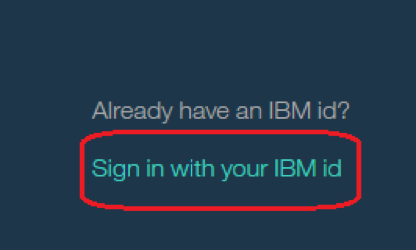

4. 1.	Follow the prompts to complete the sign up for the Data Science Experience. Two Bluemix services will be created for you (Object Storage and Apache Spark) and you should be presented with the Data Science Experience dashboard.

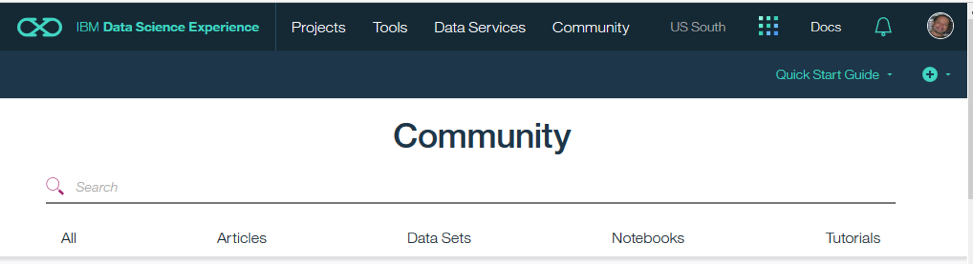

# Step 2: Deploy the testing application
In this part of the lab you'll deploy the application that you will use later to test the predictive model that you create.

1. 

2. Log in into Bluemix with your credentials by clicking on the **Log in** link at the top right.

3. Click on **Deploy**

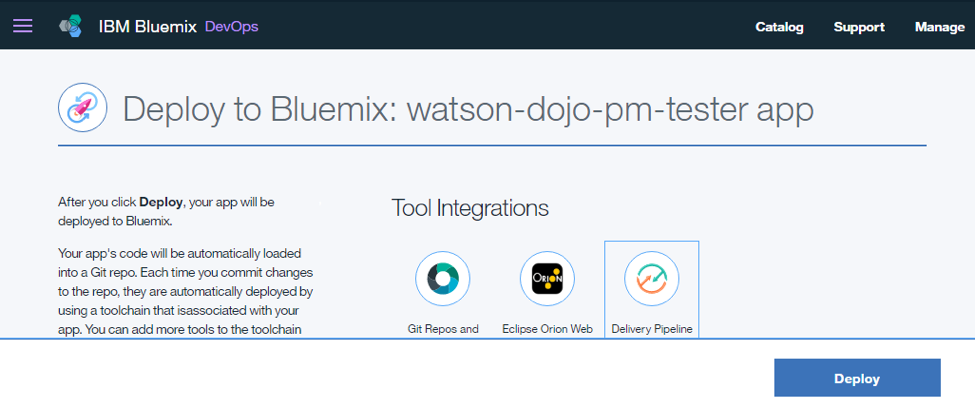

4. A Toolchain and Delivery Pipeline will be created for you to pull the app out of Github and deploy it in to Bluemix. Click on the Delivery Pipeline tile to see the status of the deployment.

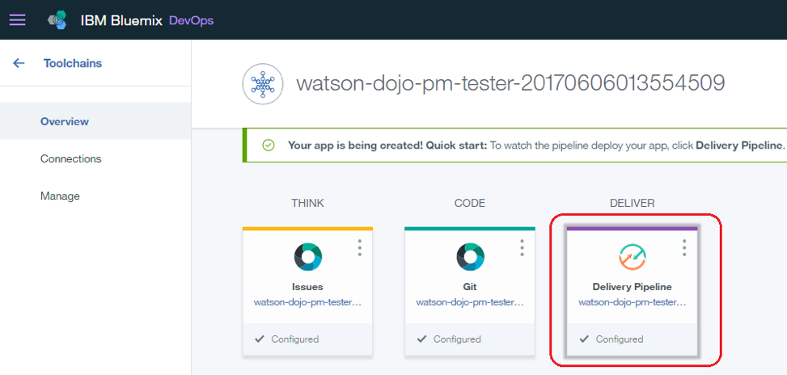

5. Wait for the **Deploy Stage** to complete successfully

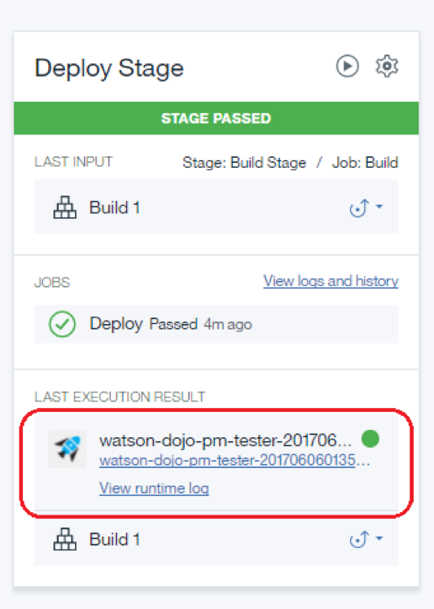

# Step 3: Create an instance of the Watson Machine Learning Service

In this part of the lab, you'll create an instance of the Watson Machine Learning service and bind it to the app that you created in part 2.

1. In your browser go to the Bluemix Dashboard. Click **Catalog**

2.	In the navigation menu at the left, select **Data  & Analytics** (under **Services**) and then select **IBM Watson Machine Learning**

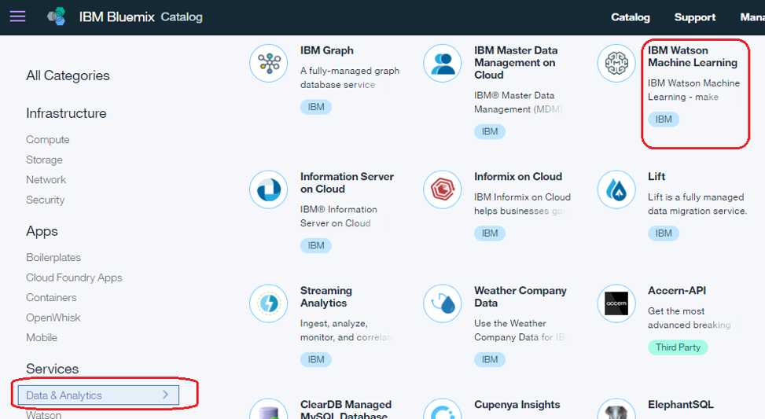

3. On the left select your app from part 2 in the drop down labeled Connect to:

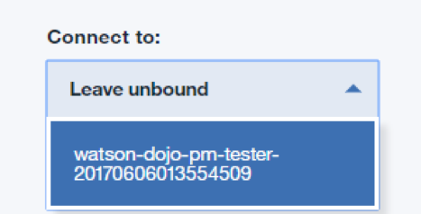

4. Click **Create**

5. Click **Restage** when you’re prompted to restage your app

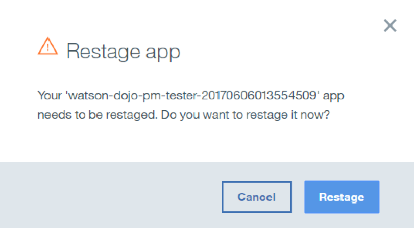

6. Go back to the Bluemix dashboard and wait until the app shows that it is running again

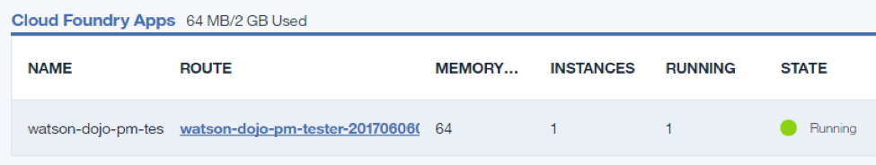

## Step 4: Create a project in the IBM Data Science Experience and bind it to your Watson Machine Learning service instance

In this part of the lab you will create a new project in the IBM Data Science Experience and bind it to your instance of the Watson Machine Learning service

1. In a new browser tab go to the [https://datascience.ibm.com](https://datascience.ibm.com)

2. Click on **Sign** in at the top of the page

3. Click on **Quick Start Guide** and then **Create New Project**

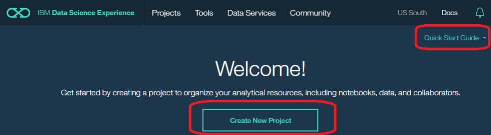

4. Enter _Watson ML Integeration_ as the project name and click **Create**

5. On the right click on Browse to upload the data file you’ll use to create a predictive model.

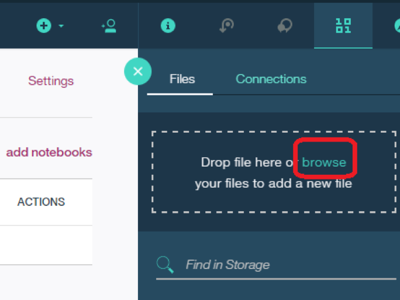

6. Select the file **patientdataV6.csv** and click **Open**.

7. The file should now appear in the Data Assets section

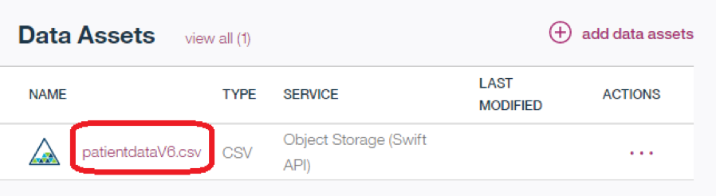

8. Click on **Settings** for the project

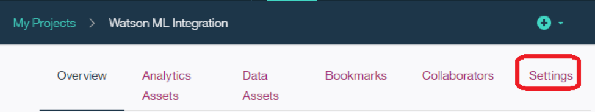

9. Click on add associated service and select **Machine Learning**

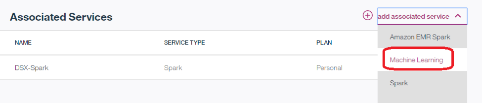

10. Choose your existing Eatson Machine Learning instance and click on **Select**

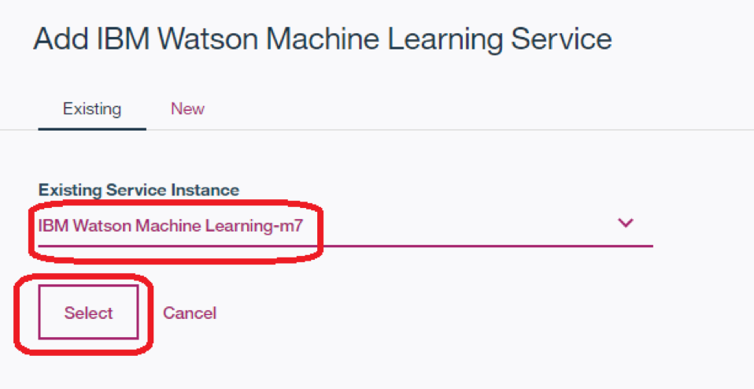

11. Click on your browser’s Back button and verify that the Watson Machine Learning service is now listed as one of your **Associated Services**

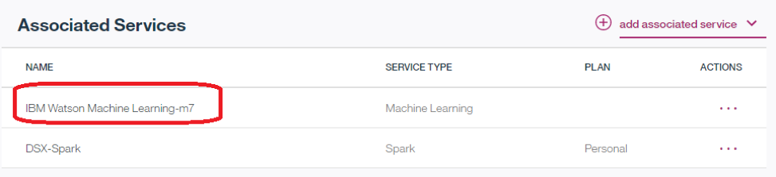

12. Leave the browser tab open for later.

## Setp 5: Save the credentials for your Watson Machine Learning Service

In this part of the lab you’ll save the credentials for your Watson Machine Learning instance so you can use it later in your code

1. In a different browser tab go to [http://bluemix.net](http://bluemix.net) and log in to the Dashboard

2. 1.	Double click on your Watson Machine Learning instance under **All Services**

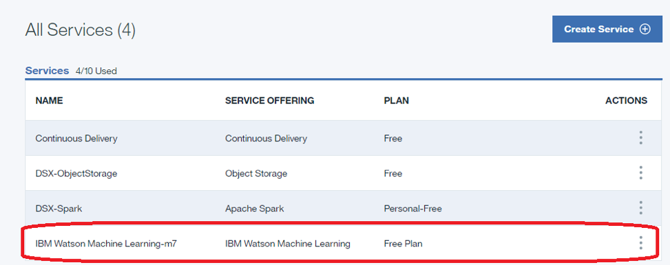

3. Click on **Service credentials** and then on **View credentials** to see the credentials

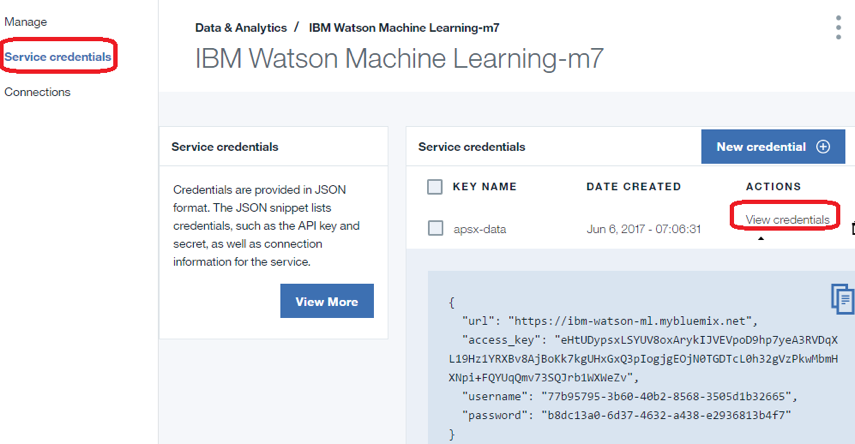

4. Save the username and password to a text file on your machine as you’ll need this information in your code later.

## Setp 6: Create a notebook in the IBM Data Science Experience

In this part of the lab you’ll create a Jupyter notebook and import the code to create a predictive model

1. In the Data Science Experience browser tab click on **Overview** and then click on **add notebooks**

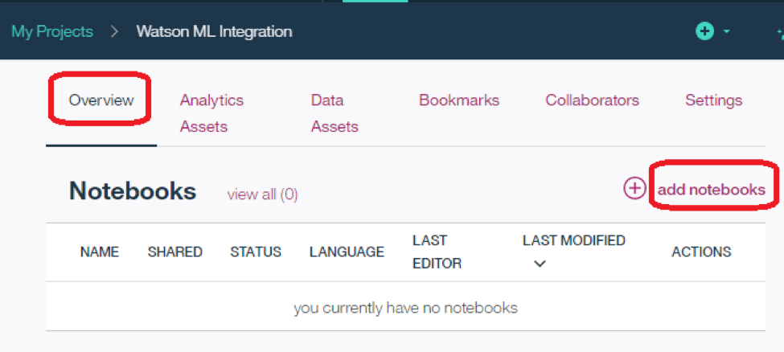

2. Click on **From File** and name the notebook _Apache Spark integration with Watson ML_

3. Under **Notebook File** select the file **demo1.ipynb**

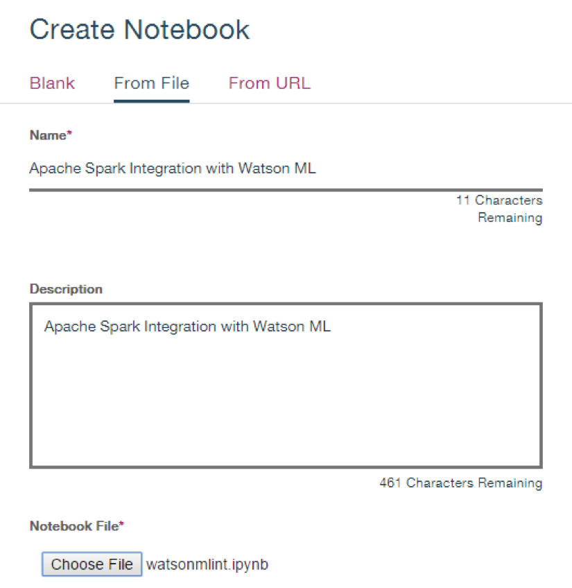

4. Click **Create Notebook** to create the new notebook

5. Leave your browser tab open for the next part

## Step 7: Run the notebook in the IBM Data Science Experience

In this part of the lab you will run the notebook code to create a predictive model and save it in the Watson Machine Learning Service.

1.  Place your cursor in the first code block in the notebook.

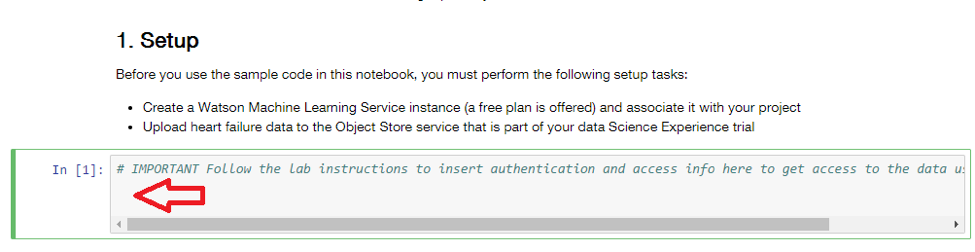

2. Click on the **Find and Add** data icon (see step 1 in diagram below) and then select **Insert to code** under the file **patientdataV6.csv** (see step 2 in diagram below). Finally select **Insert Credentials** (see step 3 in diagram below) 

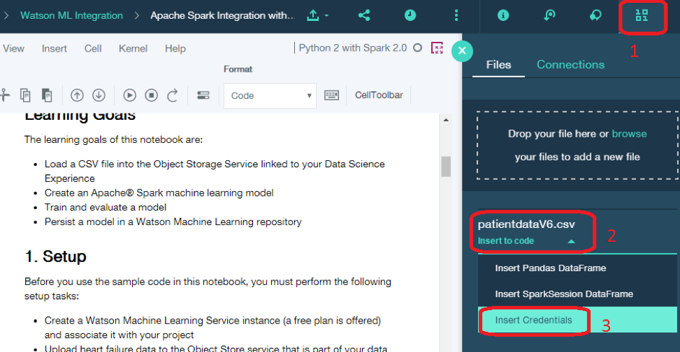

3. Your Object Storage credentials should now be in the cell. 

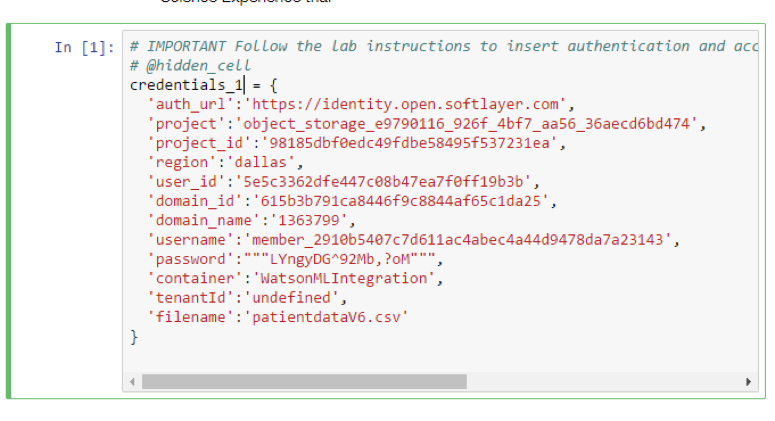

4. Click on the **Run** icon to run the code in the cell

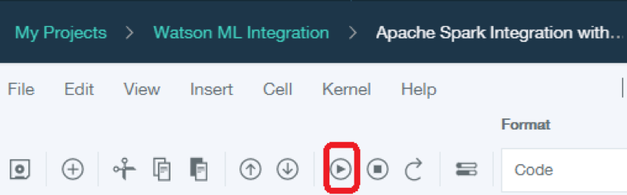

5. Move your cursor to each code cell and run the code in it. Read the comments for each cell to understand what the code is doing. **Important** when the code in a cell is still running, the label to the left changes to **In [\*]**:  . Do **not** continue to the next cell until the code is finished running.

6. When you get to the cell that says **Stop here !!!!** insert the username and password that you saved from your Watson Machine Learning instance into the code before running it.

7. Continue running each cell until you finish the entire notebook.

## Step 8: Deploy the saved predictive model as a scoring service

In this part of the lab you’ll deploy the model you save by running the Python notebook as a scoring service in Watson Machine Learning

1.	In a different browser tab go to [http://bluemix.net](http://bluemix.net) and log in to the Dashboard

2. Double click on the entry for your Watson Machine Learning service under **Services**

3. Click **Manage** and then click on the **Launch Dashboard** button in the Watson Machine Learning tile

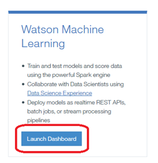

4. Your saved model should appear. Under **Actions** select **Create Deployment**

5. Name the deployment _Heart Failure Prediction Model Deployment_ and click **Save**

6. Your model should now be deployed and visible as a Deployment

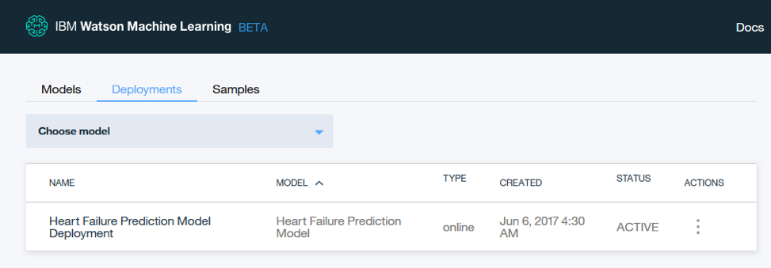

## Step 9: Test the deployed Model

In this part of the lab you’ll test the deployed model with the app that you deployed earlier.

1.	In a different browser tab go to [http://bluemix.net](http://bluemix.net) and log in to the Dashboard

2. Click on the URL for the app that you deployed earlier that tests the deployed model  

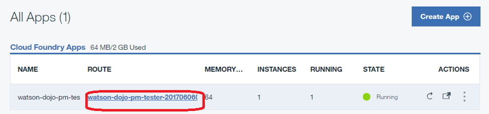

3. When the application appears click on **Score now** to test the scoring model  with the default values.  

4. Verify that the model predicts that there is a risk of heart failure for the patient with these medical characteristics

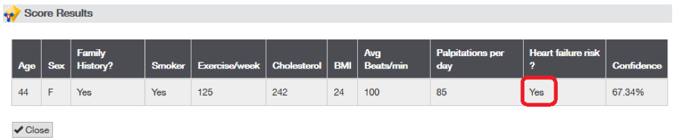

5. **Click Close**. Run the app again with the following parameters

6. Verify that the model predicts that there is not a risk of heart failure for the patient with these medical characteristics

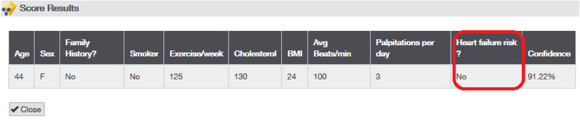

Congratulations, you successfully created a predictive model in Apache Spark and deployed and tested it using the Watson Machine Learning Service in Bluemix

## Summary
Congratulations, you successfully created a predictive model in Apache Spark and deployed and tested it using the Watson Machine Learning Service in Bluemix
