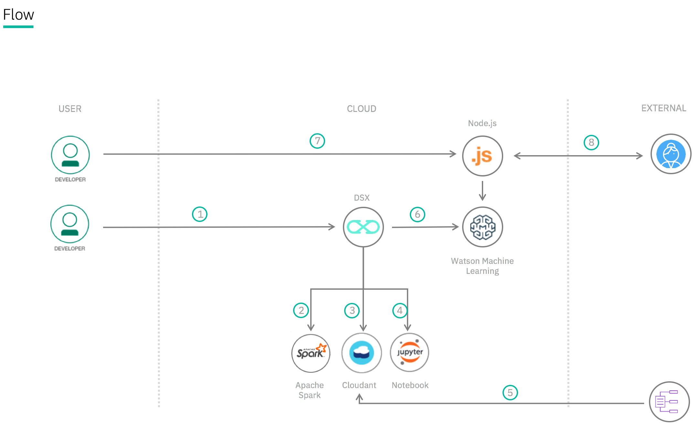

This a customized version of the Node.js sample app that is available with the [Watson Machine Learning Service on IBM Bluemix](http://www.ng.bluemix.net/docs/#services/PredictiveModeling/index.html).
This version of the app is to be used with the Data Science Experience Service to test a predictive model developed in the lab.

See the [original app](https://github.com/pmservice/predictive-modeling-samples) for a walkthrough of the source code.

# Lab - Create and deploy a scoring model to predict heart failure w/Bluemix and IBM Data Science Experience

© Copyright IBM Corporation 2017

IBM, the IBM logo and ibm.com are trademarks of International Business Machines Corp., registered in many jurisdictions worldwide. Other product and service names might be trademarks of IBM or other companies. A current list of IBM trademarks is available on the Web at &quot;Copyright and trademark information&quot; at www.ibm.com/legal/copytrade.shtml.

This document is current as of the initial date of publication and may be changed by IBM at any time.

The information contained in these materials is provided for informational purposes only, and is provided AS IS without warranty of any kind, express or implied. IBM shall not be responsible for any damages arising out of the use of, or otherwise related to, these materials. Nothing contained in these materials is intended to, nor shall have the effect of, creating any warranties or representations from IBM or its suppliers or licensors, or altering the terms and conditions of the applicable license agreement governing the use of IBM software. References in these materials to IBM products, programs, or services do not imply that they will be available in all countries in which IBM operates. This information is based on current IBM product plans and strategy, which are subject to change by IBM without notice. Product release dates and/or capabilities referenced in these materials may change at any time at IBM&#39;s sole discretion based on market opportunities or other factors, and are not intended to be a commitment to future product or feature availability in any way.

# Overview

This lab is designed to demonstrate how to use IBM Data Science Experience to build a predictive model within a Jupyter Notebook. The predictive model is then deployed to the Watson Machine Learning Service in Bluemix where it is consumed by users accessing a Node.js application.

1. The developer creates an IBM Data Science Experience Workspace.
2. IBM Data Science Experience depends on an Apache Spark service.
3. IBM Data Science Experience uses Cloud Object storage to manage your data.
4. This lab is built around a Jupyter Notebook, this is where the developer will import data, train, and evaluate their model.
5. Import data on heart failure.
6. Trained models are deployed into production using IBM's Watson Machine Learning Service.
7. A Node.js web app is deployed on Bluemix calling the predictive model hosted in the Watson Machine Learning Service.
8. A user visits the web app, enters their information, and the predictive model returns a response.

## Prerequisites

* Bluemix supported [web browser](https://console.ng.bluemix.net/docs/overview/prereqs.html#prereqs)
* An [IBM Bluemix Account](https://bluemix.net)

## Before you begin
To be able do this lab a Bluemix account is necessary. If you don't have one yet -- or you did not complete the initial set up of your Bluemix account -- follow the steps below.

Your account must have enough resources available for at least 1 application (256MB) and 3 services.

### Already registered and completed set-up

* When you already registered and completed the initial set-up of your Bluemix account, you directly jump to [Create a space in Bluemix US region](#create-a-space-in-bluemix-us-region).

### Not registered

* Use Ctrl-click (or the equivalent action for your system) to open the [Sign Up for Bluemix](https://developer.ibm.com/sso/bmregistration) page in a separate tab. Fill in the form and click **Start your FREE Bluemix trial** to complete the registration. You will receive an activation mail in your inbox.

### First time login

* Use Ctrl-click (or the equivalent action for your system) to open the [Login to Bluemix](https://console.bluemix.net/login) in a separate tab. First time users need to complete a 4-step wizard. This starts by accepting the terms & conditions.

  ![Terms & conditions][1]

  Define a name for your organization.

  ![Organization name][2]

  Choose a name for your space. Typically `dev` would be a good name for your first space.

  ![Space name][3]

  On the last page, click **I'm Ready** to complete the set up process.

### Create a space in Bluemix US region

For the remainder of the lab it is recommended to work in the US region of Bluemix. For this, use Ctrl-click (or the equivalent for your system) to open the Bluemix dashboard. Click your account and choose **US South** as your active region.

![Select US region][5]

If you are all OK, you get the dashboard. Otherwise, you will be asked to create your first space in this region -- as depicted in the screenshot below. Typically `dev` would be a good name for your space.

![Create space in US][4]

Congrats, you're now ready to start your data science experience :smiley:.

# Step 1: Sign up for IBM Data Science Experience

IBM Data Science Experience is an interactive, collaborative, cloud-based environment where data scientists can use multiple tools to activate their insights. In this part of the lab you will sign up for a 30-day trial of IBM Data Science Experience.

  1.  In a web browser navigate to [https://datascience.ibm.com](https://datascience.ibm.com).

  2.  Click on **Sign Up** at the top right.

  

  3. Click on **Sign in with your IBM id** and enter your Bluemix credentials.

  

  4. Follow the instructions to complete the sign up for IBM Data Science Experience. Please note that two Bluemix services will be created for you -- one Cloud Object Storage (SWIFT) and one Apache Spark -- and you should be presented with the Data Science Experience dashboard.

  ![DSX dashboard][6]]

# Step 2: Deploy the testing application
In this part of the lab you'll deploy the application that you will use later to test the predictive model that you create.

  1. Click on the **Deploy to Bluemix** button below.

  

  2. Log in into Bluemix with your credentials by clicking on the **Log in** link at the top right.

  3. Make sure that you deploy the application to the same region and space as where the *Apache Spark* and *Cloud Object Storage* services were created when you signed up for IBM Data Science Experience. Please take note of the space as later in this lab the Watson Machine Learning Service needs to be deployed into the same space.

  4. Click on **Deploy** to deploy the application.

  ![Deploy][7]

  5. A Toolchain and Delivery Pipeline will be created for you to pull the app out of Github and deploy it in to Bluemix. Click on the Delivery Pipeline tile to see the status of the deployment.

  

  6. Wait for the **Deploy Stage** to complete successfully.

  

# Step 3: Create an instance of the Watson Machine Learning Service

In this part of the lab, you'll create an instance of the Watson Machine Learning service and bind it to the app that you created in Step 2.

  1. In your browser go to the Bluemix Dashboard. Click **Catalog**.

  2. In the navigation menu at the left, select **Data  & Analytics** (under **Services**) and then select **Machine Learning**.

  ![Watson ML Service][8]

  3. In the Connect to drop-down, select the application that you deployed earlier in Step 2 of this lab.

  ![Connect to Service][9]

  4. Verify this service is being created in the same space as the app in Step 2.

  5. Click **Create**.

  6. Click **Restage** when you’re prompted to restage your application.

  

  7. Go back to the Bluemix dashboard and wait until the app shows that it is running again.

  ![Overview DSX services and test app][10]

## Step 4: Create a project in IBM Data Science Experience and bind it to your Watson Machine Learning service instance

In this part of the lab you will create a new project in IBM Data Science Experience and bind it to your instance of the Watson Machine Learning service.

  1. In a new browser tab go to [https://datascience.ibm.com](https://datascience.ibm.com).

  2. Click on **Sign** in at the top of the page.

  3. From the dashboard, click on **Create new** from the top-right. From the drop-down menu select **Project**.

  ![Create New Project][11]

  4. Enter _Watson ML Integration_ as the project name and click **Create**.

  5. On the right click on Browse to upload the data file you’ll use to create a predictive model.

  

  6. Select the file **patientdataV6.csv** and click **Open**.

  7. The file should now appear in the Data Assets section.

  

  8. Click on **Settings** for the project.

  

  9. Click on add associated service and select **Machine Learning**.

  

  10. Choose your existing Machine Learning instance and click on **Select**.

  

  11. Click on your browser’s Back button and verify that the Watson Machine Learning service is now listed as one of your **Associated Services**.

  

  12. Leave the browser tab open for later.

## Step 5: Save the credentials for your Watson Machine Learning Service

In this part of the lab you’ll save the credentials for your Watson Machine Learning instance so you can use it later in your code.

1. In a different browser tab go to [http://bluemix.net](http://bluemix.net) and log in to the Dashboard

2. 1.	Double click on your Watson Machine Learning instance under **All Services**

3. Click on **Service credentials** and then on **View credentials** to see the credentials

4. Save the username and password to a text file on your machine as you’ll need this information later in your code notebook.

## Step 6: Create a notebook in IBM Data Science Experience

In this part of the lab you’ll create a Jupyter notebook and import the code to create a predictive model.

1. In the Data Science Experience browser tab click on **Overview** and then click on **add notebooks**.

2. Click on **From URL** and name the notebook _Apache Spark integration with Watson ML_.

3. Under **Notebook File** select the file **demo1.ipynb**.

4. Click **Create Notebook** to create the new notebook.

5. Leave your browser tab open for the next part.

## Step 7: Run the notebook in IBM Data Science Experience

In this part of the lab you will run the Jupyter Notebook code creating a predictive model, and save it in the Watson Machine Learning Service.

1.  Place your cursor in the first code block in the notebook.

2. Click on the **Find and Add** data icon (see step 1 in diagram below) and then select **Insert to code** under the file **patientdataV6.csv** (see step 2 in diagram below). Finally select **Insert Credentials** (see step 3 in diagram below)

3. Your Object Storage credentials should now be in the cell. Ensure the variable is `credentials_1`.

4. Click on the **Run** icon to run the code in the cell

5. Move your cursor to each code cell and run the code in it. Read the comments for each cell to understand what the code is doing. **Important** when the code in a cell is still running, the label to the left changes to **In [\*]**:  . Do **not** continue to the next cell until the code is finished running.

6. When you get to the cell that says **Stop here !!!!** insert the username and password that you saved from your Watson Machine Learning instance into the code before running it.

7. Continue running each cell until you finish the entire notebook.

## Step 8: Deploy the saved predictive model as a scoring service

In this part of the lab you’ll deploy the model you save by running the Python notebook as a scoring service in Watson Machine Learning

1.	In a different browser tab go to [http://bluemix.net](http://bluemix.net) and log in to the Dashboard

2. Click on the entry for your Watson Machine Learning service under **Services**.

3. Click **Manage** and then click on the **Launch Dashboard** button in the Watson Machine Learning tile

4. Your saved model should appear. Under **Actions** select **Create Deployment**

5. Name the deployment _Heart Failure Prediction Model Deployment_ and click **Save**

6. Your model should now be deployed and visible as a Deployment

7. Restart the Node.js Web App.  From your Bluemix Dashboard select the restart icon for the web application.

## Step 9: Test the deployed Model

In this part of the lab you’ll test the deployed model with the app that you deployed earlier.

1. Click on the URL for the app that you deployed earlier that tests the deployed model  

3. When the application appears click on **Score now** to test the scoring model  with the default values.  

4. Verify that the model predicts that there is a risk of heart failure for the patient with these medical characteristics

5. **Click Close**. Run the app again with the following parameters

6. Verify that the model predicts that there is not a risk of heart failure for the patient with these medical characteristics

Congratulations, you successfully created a predictive model in Apache Spark and deployed and tested it using the Watson Machine Learning Service in Bluemix

## Summary
Congratulations, you successfully created a predictive model in Apache Spark and deployed and tested it using the Watson Machine Learning Service in Bluemix

[1]: https://github.com/eciggaar/chatbot-lab/blob/master/readmeimages/terms.png?raw=true
[2]: https://github.com/eciggaar/chatbot-lab/blob/master/readmeimages/create-org.png?raw=true
[3]: https://github.com/eciggaar/chatbot-lab/blob/master/readmeimages/create-space.png?raw=true
[4]: https://github.com/eciggaar/chatbot-lab/blob/master/readmeimages/create-us-space.png?raw=true
[5]: https://github.com/eciggaar/watson-dojo-pm-tester/blob/master/images/select-region.png?raw=true
[6]: https://github.com/eciggaar/watson-dojo-pm-tester/blob/master/images/dsx-dashboard.png?raw=true
[7]: https://github.com/eciggaar/watson-dojo-pm-tester/blob/master/images/pipeline.png?raw=true
[8]: https://github.com/eciggaar/watson-dojo-pm-tester/blob/master/images/create-ml-instance.png?raw=true
[9]: https://github.com/eciggaar/watson-dojo-pm-tester/blob/master/images/connect-to.png?raw=true
[10]: https://github.com/eciggaar/watson-dojo-pm-tester/blob/master/images/overview-services-and-app.png?raw=true
[11]: https://github.com/eciggaar/watson-dojo-pm-tester/blob/master/images/overview-services-and-app.png?raw=true
