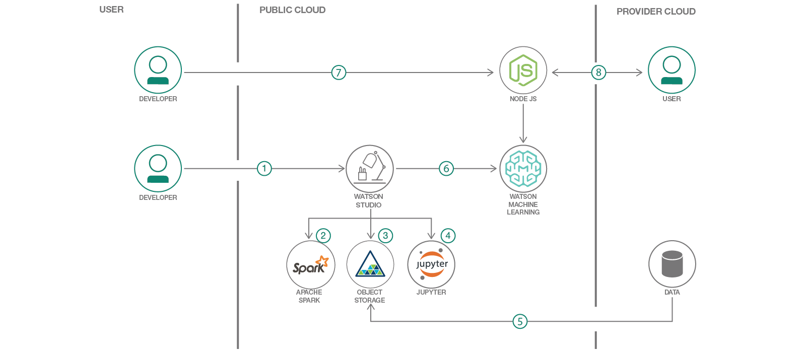
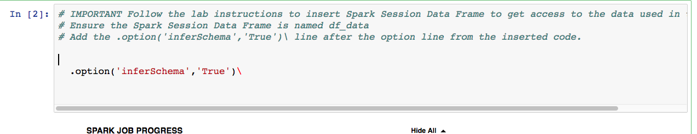
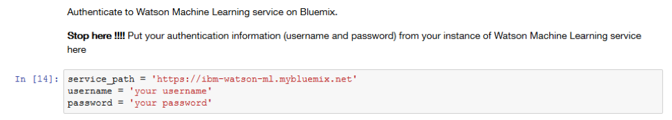

DISCLAIMER: This application is used for demonstrative and illustrative purposes only and does not constitute an offering that has gone through regulatory review.

# Create and deploy a scoring model to predict heart failure on IBM Cloud with the Watson Data Platform

> Data Science Experience is now Watson Studio. Although some images in this code pattern may show the service as Data Science Experience, the steps and processes will still work.

In this Code Pattern, we will use a Jupyter Notebook on IBM Watson Studio to build a predictive model that demonstrates a potential health care use case.
This a customized version of the Node.js sample app that is available with the [Watson Machine Learning Service on IBM Cloud](http://www.ng.bluemix.net/docs/#services/PredictiveModeling/index.html).
See the [original app](https://github.com/pmservice/predictive-modeling-samples) for a walkthrough of the source code.

When the reader has completed this Code Pattern, they will understand how to:

* Build a predictive model within a Jupyter Notebook
* Deploy the model to IBM Watson Machine Learning service
* Access the Machine Learning model via either APIs or a Nodejs app

## Flow
1. The developer creates an IBM Watson Studio Workspace.
2. IBM Watson Studio depends on an Apache Spark service.
3. IBM Watson Studio uses Cloud Object storage to manage your data.
4. This lab is built around a Jupyter Notebook, this is where the developer will import data, train, and evaluate their model.
5. Import data on heart failure.
6. Trained models are deployed into production using IBM's Watson Machine Learning Service.
7. A Node.js web app is deployed on IBM Cloud calling the predictive model hosted in the Watson Machine Learning Service.
8. A user visits the web app, enters their information, and the predictive model returns a response.

## Included components
* [IBM Watson Studio](https://www.ibm.com/bs-en/marketplace/data-science-experience): Analyze data using RStudio, Jupyter, and Python in a configured, collaborative environment that includes IBM value-adds, such as managed Spark.
* [Jupyter Notebook](http://jupyter.org/): An open source web application that allows you to create and share documents that contain live code, equations, visualizations, and explanatory text.
* [PixieDust](https://github.com/ibm-watson-data-lab/pixiedust): Provides a Python helper library for IPython Notebook.

## Featured technologies
* [Artificial Intelligence](https://medium.com/ibm-data-science-experience): Artificial intelligence can be applied to disparate solution spaces to deliver disruptive technologies.
* [Data Science](https://medium.com/ibm-data-science-experience/): Systems and scientific methods to analyze structured and unstructured data in order to extract knowledge and insights.
* [Node.js](https://nodejs.org/): An open-source JavaScript run-time environment for executing server-side JavaScript code.

<!--
# Watch the Video
TBD
-->

# Steps

1. [Deploy the testing application](#1-deploy-the-testing-application)
1. [Create an instance of the Watson Machine Learning Service](#2-create-an-instance-of-the-watson-machine-learning-service)
1. [Create a project in IBM Watson Studio and bind it to your Watson Machine Learning service instance](#3-create-a-project-in-ibm-data-science-experience-and-bind-it-to-your-watson-machine-learning-service-instance)
1. [Save the credentials for your Watson Machine Learning Service](#4-save-the-credentials-for-your-watson-machine-learning-service)
1. [Create a notebook in IBM Watson Studio](#5-create-a-notebook-in-ibm-data-science-experience)
1. [Run the notebook in IBM Watson Studio](#6-run-the-notebook-in-ibm-data-science-experience)
1. [Deploy the saved predictive model as a scoring service using the web ui](#7-deploy-the-saved-predictive-model-as-a-scoring-service-using-the-web-ui)
1. [Deploy the saved predictive model using APIs](#8-deploy-the-saved-predictive-model-using-apis)

## Prerequisites

* An [IBM Cloud Account](https://console.bluemix.net)

* An account on [IBM Watson Studio](https://dataplatform.ibm.com).

* A space in IBM Cloud US South or United Kingdom regions.

As of 2/5/2018, the Machine Learning service on IBM Cloud is only available in the US South or United Kingdom regions.

### 1. Deploy the testing application

Use Ctrl-click on the Deploy to `IBM Cloud` button below to open the deployment process in a separate tab.

  

> Note:  Make sure to deploy the application to the same region and space as where the *Apache Spark* and *Cloud Object Storage* services were created when you signed up for IBM Watson Studio. Please take note of this space as later in this lab the Watson Machine Learning service needs to be deployed into the same space.

* Click on `Deploy` to deploy the application.

  

* A Toolchain and Delivery Pipeline will be created for you to pull the app out of Github and deploy it in to IBM Cloud. Click on the Delivery Pipeline tile to see the status of the deployment. Wait for the **Deploy Stage** to complete successfully.

### 2. Create an instance of the Watson Machine Learning Service

* In your browser go to the [IBM Cloud Dashboard](https://console.bluemix.net/dashboard/apps) and click `Catalog`.

* Search for `Machine Learning`, Verify this service is being created in the same space as the app in Step 1, and click `Create`.

  

* On the Watson ML Dashboard select `Connections` on left menu panel, and `Create Connection`.  Select the application that you deployed earlier in Step 1 of this lab connecting this Watson ML service to the Cloud Foundry application deployed.

  

* Click `Restage` when you’re prompted to restage your application. The app will take a couple of minutes to be back in the `running` state.

### 3. Create a project in IBM Watson Studio and bind it to your Watson Machine Learning service instance

* In your browser go to the IBM Cloud Dashboard, click `Catalog`, and search for `Watson Studio`. Verify this service is being created in the same space as the app in Step 2, and click `Create`.

* Create a new project by clicking `+ New project` and choosing `Data Science`:

> Note: Services created must be in the same region, and space, as your Watson Studio service.
> Note: If this is your first project in Watson Studio, an object storage instance will be created.

* Enter a name for the project name and click `Create`.

* From within the new project `Overview` panel, click `Add to project` on the top right, selecting `Data asset`.

  

  A panel on the right of the screen appears, select `load` and click on `Browse` to upload the data file you'll use to create a predictive model.

* On your machine, browse to the location of the file **patientdataV6.csv** in this repository in the **data/** directory. Select the file and click on Open (or the equivalent action for your operating system).

* Once successfully uploaded, the file should appear in the `Data Assets` section.

  

* Click on the `Settings` tab for the project, scroll down to `Associated services` and click `+ Add service` ->  `Machine Learning`.

  

* Choose your existing Machine Learning instance and click on `Select`.

  

* The Watson Machine Learning service is now listed as one of your `Associated Services`.

* Click on the `Settings` tab for the project, scroll down to `Associated services` and click `+ Add service` ->  `Spark`.

* Either choose and `Existing` Spark service, or create a `New` one

  

  

* Leave the browser tab open for later.

### 4. Save the credentials for your Watson Machine Learning Service

* In a different browser tab go to [http://console.bluemix.net](http://console.bluemix.net) and log in to the Dashboard.

* Click on your Watson Machine Learning instance under `Services`, click on `Service credentials` and then on `View credentials` to see the credentials.

  

* Save the username, password and instance_id to a text file on your machine. You’ll need this information later in your Jupyter notebook.

### 5. Create a notebook in IBM Watson Studio

* In [Watson Studio](https://dataplatform.ibm.com) using the project you've created, click on `+ Add to project` -> `Notebook` OR in the `Assets` tab under `Notebooks` choose `+ New notebook` to create a notebook.
* Select the `From URL` tab.
* Enter a name for the notebook.
* Optionally, enter a description for the notebook.
* Under `Notebook URL` provide the following url: https://github.com/IBM/predictive-model-on-watson-ml/blob/master/demo1.ipynb
* Select the Spark runtime.
* Click the `Create` button.

  

### 6. Run the notebook in IBM Watson Studio

* Place your cursor in the first code block in the notebook.

  

* Click on the `Find and Add` data icon -- see step 1 in diagram below -- and then select `Insert to code` under the file **patientdataV6.csv**. This is step 2 in diagram below. Finally select `Insert SparkSession Data Frame` -- which is step 3 in diagram below.

  

> Note:  Make sure to rename the variable to `df_data` and add `.option('inferSchema','True')\`.

  

* Goto the cell that says `Stop here !!!!` during Step 5, insert the username and password that you saved from your Watson Machine Learning instance into the code before running it. Do the same after Step 6 `Save model to WML Service`.

  

* Click on the `Run` icon to run the code in the cell.

  

* Move your cursor to each code cell and run the code in it. Read the comments for each cell to understand what the code is doing. **Important** when the code in a cell is still running, the label to the left changes to **In [\*]**:.
  Do **not** continue to the next cell until the code is finished running.

### 7. Deploy the saved predictive model as a scoring service using the web UI

* In Watson Studio](https://dataplatform.ibm.com) go to you project, under `Assets` -> `Models` and click on the model you've created: `Heart Failure Prediction Model`.

* Go to the `Deployments` tab and `+ Add Deployment`.

* Give your Deployment a name, click `Create`, and it should show up with `STATUS` of `DEPLOY_SUCCESS`.

* Restart the Node.js Web App. For this, return to your IBM Cloud Dashboard, choose your application, and select restart from the `More action` three vertical dots

### 8. Deploy the saved predictive model using APIs

* To deploy the model using the APIs instead of using the Web UI, at Step 6.1, add the `instance_id` from yout Watson Machine Learning Service credentials.
During Step 6.2, after running the second cell, get the `model_id` and put it in the cell that follows.
Put the `deployment_id` in the cell under `Montitor the status of deployment`.
For Step 6.3, add the `scoring_url` to the cell.

# Sample Output

* In the dashboard, Click on the application name, then choose `Visit App URL` from the `Overview` page to open the application in a separate tab.

* When the application appears click on `Score now` to test the scoring model with the default values.

* Verify that the model predicts that there is a risk of heart failure for the patient with these medical characteristics.

* `Click Close`. Run the app again with the following parameters.

* Verify that the model predicts that there is not a risk of heart failure for the patient with these medical characteristics.

# Learn more

* **Artificial Intelligence Code Patterns**: Enjoyed this Code Pattern? Check out our other [AI Code Patterns](https://developer.ibm.com/code/technologies/artificial-intelligence/).
* **Data Analytics Code Patterns**: Enjoyed this Code Pattern? Check out our other [Data Analytics Code Patterns](https://developer.ibm.com/code/technologies/data-science/)
* **AI and Data Code Pattern Playlist**: Bookmark our [playlist](https://www.youtube.com/playlist?list=PLzUbsvIyrNfknNewObx5N7uGZ5FKH0Fde) with all of our Code Pattern videos
* **With Watson**: Want to take your Watson app to the next level? Looking to utilize Watson Brand assets? [Join the With Watson program](https://www.ibm.com/watson/with-watson/) to leverage exclusive brand, marketing, and tech resources to amplify and accelerate your Watson embedded commercial solution.
* **Watson Studio**: Master the art of data science with IBM's [Watson Studio](https://dataplatform.ibm.com/)
* **Spark on IBM Cloud**: Need a Spark cluster? Create up to 30 Spark executors on IBM Cloud with our [Spark service](https://console.bluemix.net/catalog/services/apache-spark)

# License
[Apache 2.0](LICENSE)
